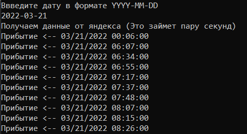
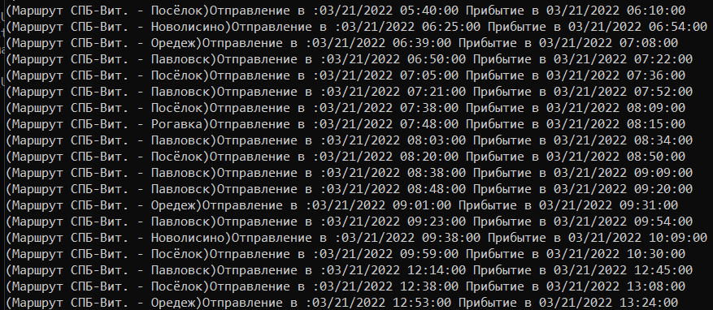
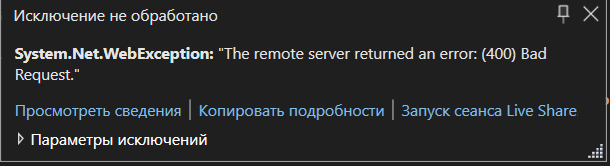

API
---

This programm is used to parce an answer from yandex.raspisanya and use it
further in the code

Эта программа созданна для парсинга ответа из яндекс.расписаний и использования
ответа далее в программе

 

To start you need to get an api key on yandex developers page. Free plan on api
key is enough to test it (500 requests every 24 hours)

[yandex developer page / кабинет
разработчка](https://developer.tech.yandex.ru/services/)

Для начала нужно получить ключ api в кабинете разработчка яндекс. Бесплатного
плана (500 запросов каждые 24 часа) достаточно для тестирования

Enter the Api key in the Schedule.cs file in this fragment of code

Введите ключ Api в файле Schedule.cs в этом фрагменте кода

 

~~~~~~~~~~~~~~~~~~~~~~~~~~~~~~~~~~~~~~~~~~~~~~~~~~~~~~~~~~~~~~~~~~~~~~~~~~~~~~~~
class Auth
        // Here we can pass the uid and api key 
        // uid is needed to check the stations on route and to check what is the next station
        // Сюда мы передаем ключ от api и uid
        // uid используется чтобы проверить станции по маршруту и проверить какая следующая станция
        {
            private string uid;
            private string api_key;
            public string Uid
            {
                get { return this.uid; }
                set { this.uid = value; }
            }

            public string key
            {
                get { return "API KEY HERE"; }
                set { }
            }
        }
~~~~~~~~~~~~~~~~~~~~~~~~~~~~~~~~~~~~~~~~~~~~~~~~~~~~~~~~~~~~~~~~~~~~~~~~~~~~~~~~

Станции / Stations
------------------

 

To get the station ID you need to call the stationID_get(lat, lon) function.
Pass the latitude and longitude as string variables. The function will print the
json answer in console. Search for station_type field and if it equals suburban
then copy the station ID.

 

Чтобы получить ID станции надо вызвать функцию stationID_get(lat, lon). Как
аргументы передаем долготу и широту как string. Функция выведет все ближайшие
станции по данным координатам. Найдите поле station_type и если оно равно
suburban то скопируйте ID станции.

 

>   I know there is a way to get the station ID’s automatically but rn I don’t
>   have enough time to research it

>   Да, я знаю что есть вариант автоматически получать ID станций. Но сейчас у
>   меня не хватает времени чтобы закончить с этим так что пока что так.

Описания функций / Functions description
----------------------------------------

Right now there is only 3 functions

Сейчас написано только 3 функции

 

1.  station_timetable_get()

2.  stationID_get()

3.  route_time_get()

 

### station_timetable_get(string date, string station, bool from_station)

This function returns a list with station schedule of all arrivals or
departures.

You need to pass the date that’s either today or in the future. Past dates will
not work

station is station code. This is pretty much self-explanatory

from_station is a variable that sets the output to departure or to arrival

 

Эта функция возращает лист с расписанием станции со всеми прибытиями или
отправлениями

Для работы надо передать дату которая либо сегодня либо в будующем. Прошедшие
даты вызывают ошибку

station это код станции. Тут все довольно таки просто

from_station - эта переменная устанавливет вывод либо только прибытий, либо
только отправлений

 

Вывод функции / function output

 

### route_time_get(string date, string from, string to)

This function returns a list with station schedule of all arrival to station
“to” and departure “from”.

You need to pass the date that’s either today or in the future. Past dates will
not work

station is station code. This is pretty much self-explanatory

from and to are station codes

 

Эта функция возращает лист с расписанием станции с прибытиями на станцию “to” и
отправлениями с станции “from”

Для работы надо передать дату которая либо сегодня либо в будующем. Прошедшие
даты вызывают ошибку

station это код станции. Тут все довольно таки просто

from и to это ID станций

Вывод функции / function output

 

Даты / dates
------------

Right now getting an old schedule is kinda buggy and i’m already trying to fix
it. For now I recommend to only enter dates that are either are now or in
future. Past dates might work to with a 50% chance

 

Сейчас получение расписания прошедшого дня немного лагает и я пытаюсь это
починить. Пока что я рекомендую вводить даты которые сейчас или в будуещем.
Прошедшие даты могут сработать с шансом в 50%

 

 

To-Do
-----

1.  Сделать обработку исключения при ошибке 400 \| Deal with exception “bad
    request 400”

2.  Сделать проверку на дату \| Make a function that checks the date

3.  Сделать получение всех станций по направлению автоматически \| Make getting
    station ID’s automatic

4.  Попробавть дописать модуль работы с алисой \| Try to make it work with alice
    voice assistant
